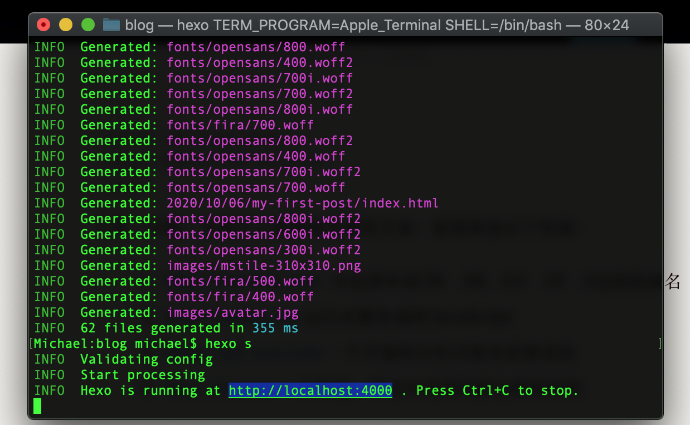

不花一分钱，实现个人顶级域名博客方案；需要准备以下资源：

1. http://freenom.com  可免费申请.TK   .ML  .GA   .CF   .GQ顶级域名
2. http://nodejs.org 运行在服务端的 JavaScript
3. https://git-scm.com 一个开源的分布式版本控制系统
4. http://hexo.io 一个快速、简洁且高效的静态博客框架

Hexo 是一个快速、简洁且高效的静态博客框架。通过Markdown编辑的文章可瞬间生成静态博客文章。

git init  //初始化本地仓库
git add source //将必要的文件依次添加，有些文件夹如npm install产生的node_modules由于路径过长不好处理，所以这里没有用`git add .`命令了，而是依次添加必要文件，如下图所示
git commit -m "Blog Source Hexo"
git branch hexo  //新建hexo分支
git checkout hexo  //切换到hexo分支上
git remote add origin git@github.com:yourname/yourname.github.io.git  //将本地与Github项目对接
git push origin hexo  //push到Github项目的hexo分支上