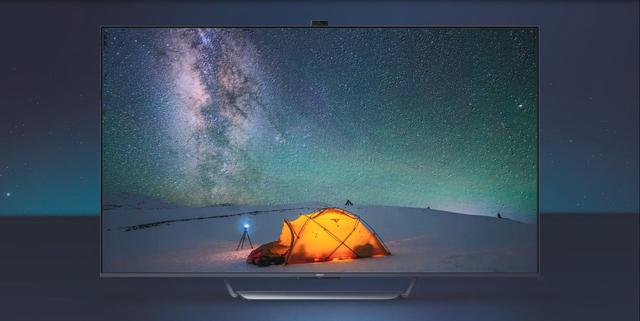

OPPO 宣布将于 10 月 19 日在上海举行新品发布会，正式发布旗下首款智能电视。此前 OPPO 在一则短片中曝光了 OPPO 智能电视的神秘面纱，它采用升降式摄像头方案，屏幕下方为银色底座，配合超窄边框设计，正面视觉效果出众。

据悉，OPPO 智能电视有 55 和 65 英寸两种尺寸，采用 120Hz 量子点全面屏。说到量子点屏幕，它属于创新半导体纳米晶体技术，高效提升显示屏的色域值，让色彩更加纯净鲜艳，使色彩表现更具张力。

当前有两款 OPPO 电视已经通过 3C 认证，其型号分别为 A65U0B00 和 A55U0B00，屏幕尺寸分别为 55 英寸和 65 英寸，两款电视的生产厂为冠捷显示科技（厦门）有限公司。

OPPO 介绍，OPPO 智能电视将是万物互融下家庭场景的内容生态入口，而且这次 OPPO 智能电视将会带来系统级新玩法，值得期待。